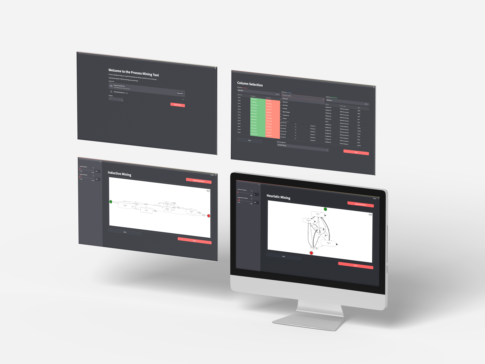

# Process-Mining-Visualization

Implementation of a desktop app for importing event logs, mining and visualizing process models by using different algorithms (like alpha miner, heuristic miner, inductive miner, fuzzy miner) and metrics for filtering nodes and edges on mined process models. Mined process models can be exported as images.

# Status

This project is at version 0.2.0
Ready for use. Hopefully no severe bugs.

The Heuristic Miner, Fuzzy Miner and Inductive Miner algorithms have been implemented.

# Ensure the virtual environment is installed. If it hasn't been already then

Create a new directory, e.g venv and install the virtual environment using command:

```bash
pip install virtualenv
```

# Activate the virtual environment

Navigate to the main directory and confirm its name (in this case, 'venv', the second parameter), then execute:

```bash
python -m venv venv
```

Move to venv/Scripts/ then activate virtual environment(Windows) using command:

```bash
source activate
```

# Requirements

Python version 3.10.7, 3.11.6, 3.12.2 ----- Older versions likely to work as well, but not tested.
Download Python from <www.python.org>

Graphviz
To install Graphviz, visit the Graphviz website (<https://graphviz.org/>) and download the appropriate installer for your operating system. Follow the installation instructions provided by the Graphviz project to install it on your system.

After installing Graphviz, open a new terminal or command prompt and run the following command to verify if the dot command is accessible:

```bash
dot -V
```

Add Graphviz to the PATH: If the dot command is not found, you need to add the Graphviz executables directory to the system's PATH environment variable. The steps to do this depend on your operating system:
Windows: Open the "System Properties" window and go to the "Advanced" tab. Click on the "Environment Variables" button, find the "Path" variable in the "System variables" section, and edit it. Add the directory containing the Graphviz executables (e.g., C:\Program Files\Graphviz\bin) to the list of paths. Click "OK" to save the changes.

Linux/macOS: Edit the .bashrc or .bash_profile file in your home directory (or the appropriate shell configuration file for your shell). Add the following line at the end of the file, replacing /path/to/graphviz/bin with the actual path to the Graphviz executables:

```bash
export PATH="/path/to/graphviz/bin:$PATH"
```

Save the file and restart the terminal for the changes to take effect.

Other required Python libraries are in requirements.txt and can be installed with

```bash
pip install -r requirements.txt
```

# Usage Interface

Open a CMD in THIS folder and type

```bash
streamlit run streamlit_app.py
```

It will open the browser.

## How to run unit tests?

Unittest can be run by the following command:

```bash
python -m unittest <Path To Tests>
```

in the root folder.

The testing requirements need to be installed. This are written in the `tests/test_requirements.txt` file.
These can be installed using the following command:

```bash
pip install -r tests/test_requirements.txt
```

If you want to run unit tests of `heuristic_mining_test.py` in the directory `tests/mining_algorithms`, just type the command below:

```bash
python -m unittest tests.mining_algorithms.heuristic_mining_test
```

To run all tests us the following command:

```bash
python -m unittest tests
```
